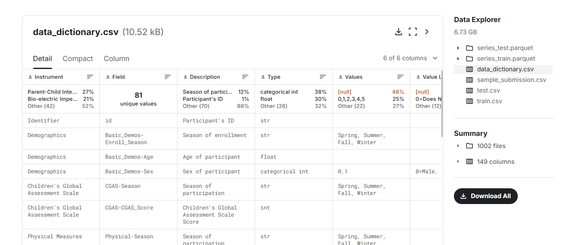

# Child Mind Institute Solution INT3405E

## Introduction
This project aims to address the **Problematic Internet Use** challenge provided by the Child Mind Institute on Kaggle. The goal is to build robust machine learning models to analyze and predict internet usage behavior based on structured data.

---

## Project Structure

Child Mind Institute/
├─ configs/  
│  ├─ config.py  
├─ models/  
│  ├─ random_forest.py  
│  ├─ xgb.py  
│  ├─ kappa.py  
│  ├─ lgbm.py  
│  ├─ majority_voting.py  
├─ notebooks/  
├─ networks/  
│  ├─ auto_encoder.py  
├─ scripts/  
│  ├─ scripts.py  
│  ├─ train.py  
├─ README.md  

---

### Folder Descriptions
- **configs/**: Contains configuration files (e.g., model parameters, environment setup).
- **models/**: Scripts for machine learning models, including Random Forest, XGBoost, LightGBM, and Majority Voting.
- **notebooks/**: Jupyter notebooks for data exploration, analysis, and preparing final submissions.
- **networks/**: Contains scripts for neural network models like Autoencoder.
- **scripts/**: Includes utility scripts like `train.py` for model training and `scripts.py` for other helper functions.

---

## How to Implement in Kaggle

### Step 1: Download the Notebook
Download the `notebooks/final_submission.ipynb` file, which serves as the primary notebook for running and preparing submissions.

### Step 2: Join the Kaggle Competition
Visit the [Child Mind Institute Problematic Internet Use](https://www.kaggle.com/competitions/child-mind-institute-problematic-internet-use/overview) competition page. Join the competition and create a team to participate.

### Step 3: Run the Code
1. Open the `final_submission.ipynb` notebook.
2. Run all code cells to:
   - Load and preprocess data.
   - Train the machine learning models.
   - Evaluate model performance.
   - Generate the final `submission.csv`.

### Step 4: Generate the Submission
After executing all notebook cells, the `submission.csv` file will be generated. Use this file for submission on Kaggle.

### Step 5: Submit the Submission
Log in to Kaggle and upload your `submission.csv` file using the **Submit** button.

---

## Models Used
The following models are implemented in this project:

1. **Random Forest with GridSearchCV and Pipeline**:
   - A Random Forest model with hyperparameter tuning via GridSearchCV, integrated into a Pipeline for streamlined training and evaluation.

2. **LightGBM**:
   - Light Gradient Boosting Machine, known for its speed and efficiency in gradient boosting.

3. **XGBoost**:
   - Extreme Gradient Boosting, widely used for structured data problems due to its high performance.

4. **Majority Voting**:
   - An ensemble method combining predictions from multiple models to enhance robustness and accuracy.

---

## EVALUATE AND RESULT (Quadratic Weighted Kappa evaluating)

   - For more information, visit this link [QWK](extension://mjdgandcagmikhlbjnilkmfnjeamfikk/https://educationaldatamining.org/EDM2023/proceedings/2023.EDM-long-papers.9/2023.EDM-long-papers.9.pdf)

   - Let's breakdown the contents about QWK values

### Mean Train QWK
   - QWK is a metric used to evaluate the agreement between two raters or predictions compared to actual values.  Mean Train QWK is the average QWK score over all folds or batches in a cross-validation or training cycle.

### Mean Validation QWK 
   - Similar to Mean Train QWK, but calculated on the validation set during training. It helps monitor model performance on validation data, detect overfitting, and guide hyperparameter tuning.

### Optimized QWK
   - Refers to the QWK score obtained after optimizing thresholds or other hyperparameters to maximize the metric.
   - Low QWK Validation score (0.3429): The performance on the test set is much lower than the training set. This is a clear sign of overfitting
   - Optimized QWK SCORE (0.433): After optimizing the threshold, the QWK score increased slightly compared to Validation QWK, showing that optimizing the threshold has partially improved the effectiveness.
#### Version 0.43
   - High Train QWK score (0.9471): This shows that the model works very well on the training set, However, this can also signal the risk of overfitting.
   - Validation QWK score increased slightly (0.3514):  showing that the model generalizes better and has less overfitting.
   - Optimized QWK SCORE (0.477): After optimizing the threshold, QWK score increased compared to Validation QWK, and this version has a higher optimization score than the previous version (0.477 > 0.433).
#### Version 0.433
   - Train QWK score decreased significantly (0.4119): The model is less focused on the training set because LightGBM integrates regularization (L1, L2), which helps reduce overfitting.
#### Version 0.443 & 0.45
   - Reduced training time (about 6 minutes) thanks to autoencoder. The autoencoder could have reduced the dimensionality of the input data or extracted useful features, helping to train the model faster.
   - Slightly increased model performance on the training set, showing that autoencoder helps the model learn better on known data without losing its ability to fit.
   - About the reduction in validation scores, the validation set is not representative enough of the entire distribution of test data on Kaggle. More powerful models often perform better on new data, even if they score lower on the validation set.Thanks to autoencoder, although the validation score is lower, the generalization ability is better, leading to a higher score on Kaggle.
---

## Contributors
**Team Members**:
- **K-ICM**
  - Do Dinh Dung - 22028169
  - Vu Viet Hung - 22028124
  - Le Van Luong - 22028040

---

# How to run without Kaggle 

Because the competition expired, so we only can execute the training on our IDE, this steps help you how to train the data without Kaggle, more specifically, in our own IDE.

## Package Installation 

Install the required packages using the command below:
```sh
pip install -r requirements.txt

```

## Data for training 

As Kaggle's information, the data they provided is just the data for training and we have **NO** data test, so if you run later, you'll just get the submission.csv instead of the real point results.

However, you can still download the data or submit your (or our) version before the competition officially finishes.

### Step 1: Visit Kaggle's CMI competition

Visit this [link](https://www.kaggle.com/) and create an Kaggle's account.

### Step 2: Join CMI competition

After you successfully create a Kaggle's account, try participating in CMI competition [here](https://www.kaggle.com/competitions/child-mind-institute-problematic-internet-use/overview) by filling your own information.

### Step 3: Reach the dataset

In the sub-navigation bar appearing at the top-center of the competition, select Data field, scroll down to the last of its section, you will see the Download button at Data Explore article. 




### Step 4: Import and Execute

After download the dataset, redirect it into your code project, install all packages and select Run. (You may need to change the path from configs/config.py to your dataset's path).